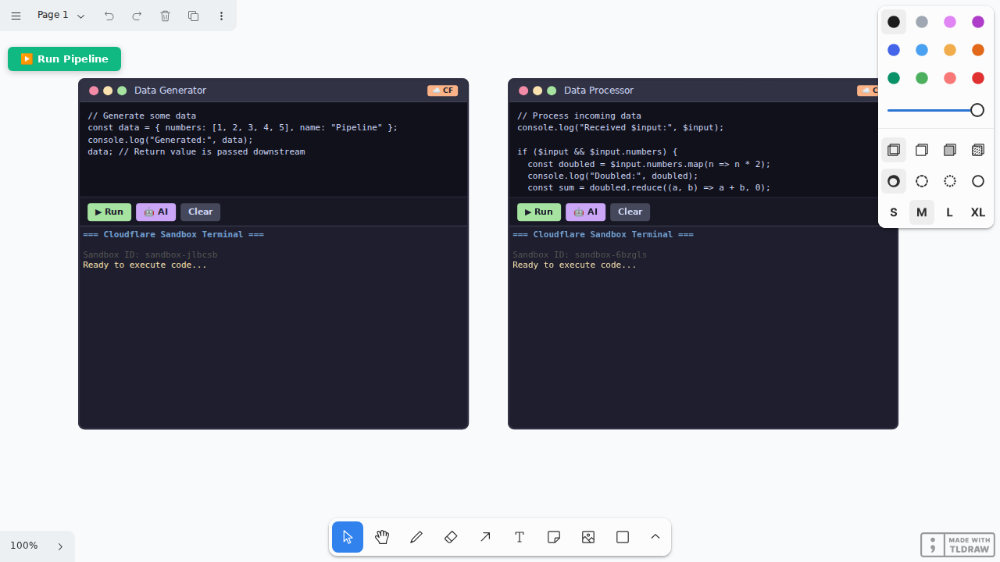

# TLDraw Sandbox

**An infinite canvas with AI-powered code terminals.** Write prompts, generate code with AI, and execute it instantly—all connected on a visual canvas.



## Features

- 🎨 **Infinite Canvas** — Built on TLDraw's powerful drawing SDK
- 🤖 **AI Code Generation** — Describe what you want, get working code
- ⚡ **Instant Execution** — Run code safely in isolated sandboxes  
- 🔗 **Pipeline Support** — Connect terminals with arrows, data flows downstream via `$input`
- 🖥️ **Beautiful Terminals** — xterm.js with Catppuccin Mocha theme

## Quick Start

```bash
git clone https://github.com/anthropics/tldraw-sandbox.git
cd tldraw-sandbox
npm install

# Start the sandbox server
npm run server

# In another terminal, start the frontend
npm run dev
```

Open http://localhost:8000

## How It Works

1. **Click 🤖 AI** — Opens prompt input
2. **Describe your code** — "fibonacci with memoization", "binary search tree", etc.
3. **Press Enter** — AI generates the code
4. **Click ▶ Run** — Executes in a sandboxed environment
5. **Connect terminals** — Draw arrows between terminals to create data pipelines
6. **Click ▶️ Run Pipeline** — Executes all connected terminals in order

## Pipelines

Connect terminals with TLDraw's arrow tool:
- Output from upstream terminals is available as `$input` in downstream terminals
- The pipeline executes in topological order based on arrow connections
- Perfect for data transformation workflows

```javascript
// Terminal 1: Generate data
const data = { numbers: [1, 2, 3, 4, 5] };
console.log("Generated:", data);
data; // Return value passes downstream

// Terminal 2: Process data (connected via arrow)
console.log("Received:", $input);
const doubled = $input.numbers.map(n => n * 2);
console.log("Doubled:", doubled);
```

## Configuration

Set your API key in `.env`:

```bash
# OpenRouter (supports multiple models)
ANTHROPIC_API_KEY=sk-or-v1-...
```

Change the model in `server.js`:

```javascript
model: 'meta-llama/llama-3.3-70b-instruct'  // Current default
```

## Tech Stack

- [TLDraw](https://tldraw.com) — Infinite canvas SDK
- [xterm.js](https://xtermjs.org) — Terminal emulator  
- [OpenRouter](https://openrouter.ai) — AI model gateway
- [Vite](https://vitejs.dev) + [React](https://react.dev)

## License

MIT
